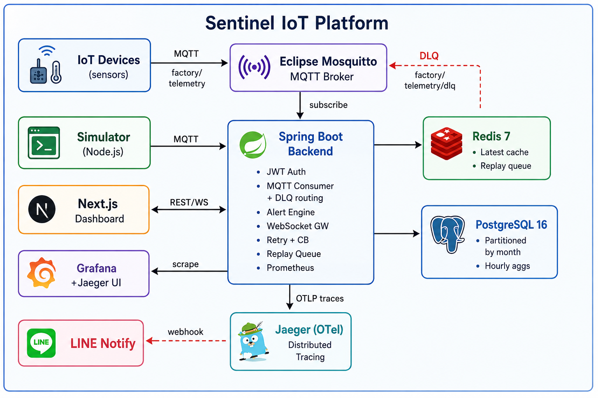
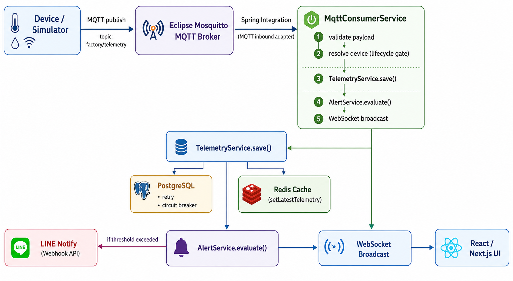
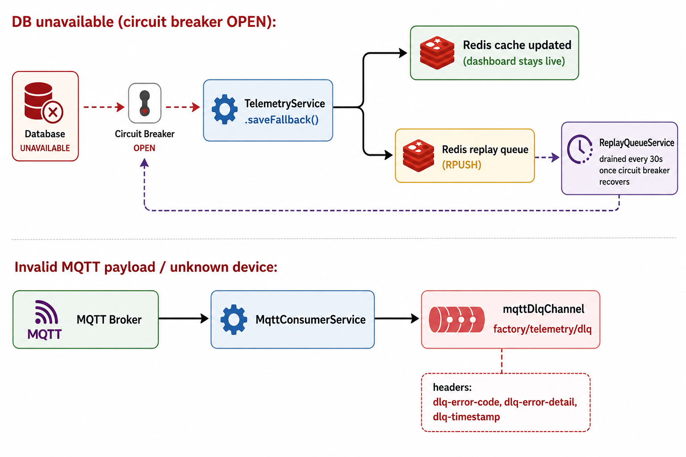
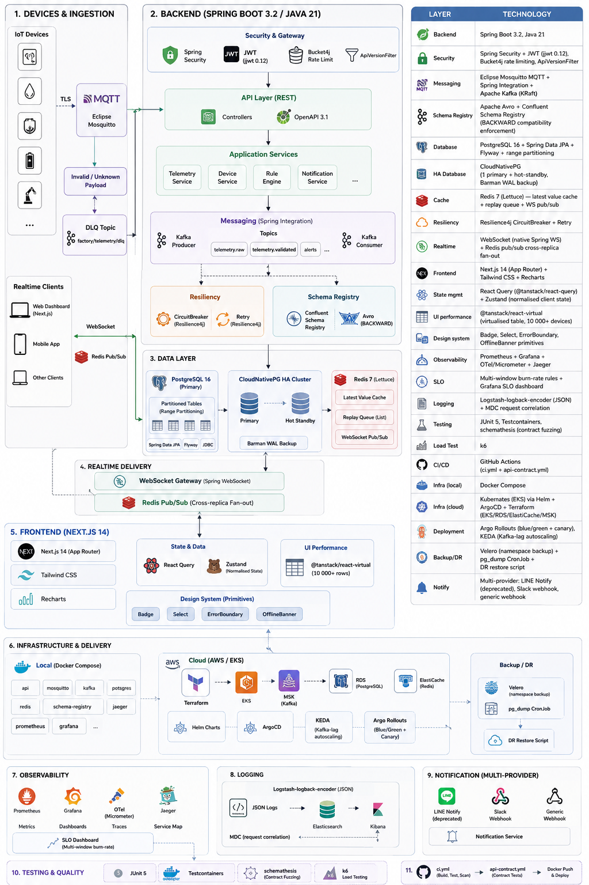

# ⚡ Sentinel IoT Platform

[](https://github.com/yourusername/sentinel-iot-platform/actions/workflows/ci.yml)
[](https://openjdk.org/)
[](https://spring.io/projects/spring-boot)
[](https://nextjs.org/)
[](https://docs.docker.com/compose/)
[](LICENSE)

**Production-grade Industrial IoT Monitoring Platform** — real-time sensor data ingestion via MQTT, threshold alerting, LINE Notify integration, WebSocket dashboard, and full observability stack.

> Cache read path sustains **1,000 req/s** (60,000+ ops/min) at p95 < 120ms under k6 load test — MacBook Pro M3, 16 GB RAM, Docker Compose.

---

## Architecture Diagram



<!-- ASCII Diagram
```text
┌────────────────────────────────────────────────────────────────────────────────┐
│                            Sentinel IoT Platform                               │
│                                                                                │
│  ┌──────────────┐    MQTT        ┌───────────────────┐                         │
│  │ IoT Devices  │───────────────▶│ Eclipse Mosquitto │                         │
│  │  (sensors)   │  factory/      │   MQTT Broker     │◀── DLQ ── factory/      │
│  └──────────────┘  telemetry     └────────┬──────────┘        telemetry/dlq    │
│                                           │ subscribe                          │
│  ┌──────────────┐              ┌──────────▼───────────┐   ┌─────────────────┐  │
│  │  Simulator   │── MQTT ─────▶│   Spring Boot        │──▶│ Redis 7         │  │
│  │  (Node.js)   │              │   Backend            │   │ • Latest cache  │  │
│  └──────────────┘              │                      │   │ • Replay queue  │  │
│                                │  • JWT Auth          │   └─────────────────┘  │
│  ┌──────────────┐  REST/WS     │  • MQTT Consumer     │                        │
│  │  Next.js     │◀────────────▶│    + DLQ routing     │   ┌─────────────────┐  │
│  │  Dashboard   │              │  • Alert Engine      │──▶│ PostgreSQL 16   │  │
│  └──────────────┘              │  • WebSocket GW      │   │ • Partitioned   │  │
│                                │  • Retry + CB        │   │   by month      │  │
│  ┌──────────────┐              │  • Replay Queue      │   │ • Hourly aggs   │  │
│  │   Grafana    │◀── scrape ───│  • Prometheus        │   └─────────────────┘  │
│  │  +Jaeger UI  │              └──────────┬───────────┘                        │
│  └──────────────┘                         │ OTLP traces                        │
│                                  ┌────────▼────────┐                           │
│  ┌──────────────┐                │ Jaeger (OTel)   │                           │
│  │ LINE Notify  │◀── webhook ─── │ Distributed     │                           │
│  └──────────────┘                │ Tracing         │                           │
│                                  └─────────────────┘                           │
└────────────────────────────────────────────────────────────────────────────────┘
```
-->

### Data Flow — Normal Path



<!-- ASCII Diagram
```text
Device/Simulator
  │── MQTT publish ──▶ Mosquitto
                          │── Spring Integration ──▶ MqttConsumerService
                                                          │── validate payload
                                                          │── resolve device (lifecycle gate)
                                                          │── TelemetryService.save()
                                                          │        │── PostgreSQL (retry + CB)
                                                          │        └── Redis cache (setLatestTelemetry)
                                                          │── AlertService.evaluate()
                                                          │        └── LINE Notify (if threshold exceeded)
                                                          └── WebSocket broadcast ──▶ React UI
```
-->

### Data Flow — Failure Paths



<!-- ASCII Diagram
```text
DB unavailable (circuit breaker OPEN):
  TelemetryService.saveFallback()
     │── Redis cache updated (dashboard stays live)
     └── Redis replay queue (RPUSH)  ←── drained every 30s by ReplayQueueService
                                              once circuit breaker recovers

Invalid MQTT payload / unknown device:
  MqttConsumerService
     └── mqttDlqChannel ──▶ factory/telemetry/dlq
           headers: dlq-error-code, dlq-error-detail, dlq-timestamp
```

---
-->

## Tech Stack



<!-- ASCII Table
| Layer        | Technology                                                   |
|--------------|--------------------------------------------------------------|
| Backend      | Spring Boot 3.2, Java 21                                     |
| Security     | Spring Security + JWT (jjwt 0.12), Bucket4j rate limiting    |
| Messaging    | Eclipse Mosquitto MQTT + Spring Integration                  |
| Database     | PostgreSQL 16 + Spring Data JPA + Flyway + range partitioning|
| Cache        | Redis 7 (Lettuce) — latest value cache + replay queue        |
| Resiliency   | Resilience4j CircuitBreaker + Retry                          |
| Realtime     | WebSocket (native Spring WS)                                 |
| Frontend     | Next.js 14 (App Router) + Tailwind CSS + Recharts            |
| Observability| Prometheus + Grafana + OTel/Micrometer + Jaeger              |
| Logging      | Logstash-logback-encoder (JSON) + MDC request correlation    |
| Testing      | JUnit 5, Testcontainers (Postgres + Redis + Mosquitto)       |
| Load Test    | k6                                                           |
| CI/CD        | GitHub Actions                                               |
| Infra        | Docker Compose                                               |
| Notify       | LINE Notify                                                  |
-->

---

## Quick Start

### Prerequisites

- Docker + Docker Compose v2
- (Optional) JDK 21 and Node 20 for local dev

### Run the full stack

```bash
git clone https://github.com/yourusername/sentinel-iot-platform.git
cd sentinel-iot-platform
cp .env.example .env          # set JWT_SECRET and optionally LINE_NOTIFY_TOKEN
docker compose up --build
```

| Service       | URL                                    |
|---------------|----------------------------------------|
| Dashboard     | <http://localhost:3000>                |
| Backend API   | <http://localhost:8080/api>            |
| Swagger UI    | <http://localhost:8080/swagger-ui.html>|
| Prometheus    | <http://localhost:9090>                |
| Grafana       | <http://localhost:3001>                |
| Jaeger UI     | <http://localhost:16686>               |
| MQTT Broker   | `tcp://localhost:1883`                 |

**Default credentials:**

- Dashboard: `admin` / `admin123` or `operator` / `op123`
- Grafana: `admin` / `admin`

---

## API Reference

### Authentication

```http
POST /api/auth/login
Content-Type: application/json

{ "username": "admin", "password": "admin123" }

→ 200 { "accessToken": "eyJ...", "refreshToken": "uuid.uuid", "role": "ADMIN", "username": "admin" }

POST /api/auth/refresh
Content-Type: application/json

{ "refreshToken": "uuid.uuid" }

→ 200 { "accessToken": "eyJ...", "refreshToken": "new-uuid.uuid", ... }

POST /api/auth/logout          # Revokes all refresh tokens for authenticated user
Authorization: Bearer <accessToken>
```

> Tokens: access token expires in **15 minutes**; refresh token expires in **7 days** with automatic rotation on every use.

### Devices

```http
POST   /api/devices                           # ADMIN only
GET    /api/devices                           # ADMIN + OPERATOR
GET    /api/devices/{id}                      # ADMIN + OPERATOR
PATCH  /api/devices/{id}/lifecycle            # ADMIN only
PATCH  /api/devices/{id}/firmware             # ADMIN only
```

**Create device:**

```json
{ "name": "sensor-1", "description": "Line A temperature sensor", "location": "Factory Hall B" }
```

**Update lifecycle:**

```json
{ "lifecycleStatus": "ACTIVE" }
```

Valid transitions: `PROVISIONED → ACTIVE → INACTIVE → DECOMMISSIONED`.
`DECOMMISSIONED` is terminal — no further transitions are accepted (HTTP 409).
Setting `INACTIVE` or `DECOMMISSIONED` also forces the device `status` to `OFFLINE`.

**Update firmware version:**

```json
{ "firmwareVersion": "1.2.3" }
```

Version must be semver (`\d+\.\d+\.\d+(-[\w.]+)?`). Rejected for decommissioned devices.

### Telemetry

```http
GET /api/telemetry/{deviceId}/latest?limit=50          # Last N raw rows (max 200)
GET /api/telemetry/{deviceId}/cache                    # Sub-ms Redis read — most recent reading
GET /api/telemetry/{deviceId}/range?from=…&to=…        # Raw rows within a time range (ISO-8601)
GET /api/telemetry/{deviceId}/hourly?from=…&to=…       # Hourly aggregates (avg/min/max, persists beyond retention)
GET /api/telemetry/stats                               # { lastMinute, replayQueueSize }
```

Hourly aggregate response shape:

```json
{
  "hourBucket": "2025-01-15T14:00:00Z",
  "tempAvg": 71.4, "tempMin": 65.2, "tempMax": 88.1,
  "humAvg": 58.0,  "humMin": 45.0,  "humMax": 72.0,
  "smokeAvg": 23.5, "smokeMax": 310.0,
  "motionCount": 7, "sampleCount": 720
}
```

### Alerts

```http
GET /api/alerts
GET /api/alerts/unacknowledged
PUT /api/alerts/{id}/acknowledge    # ADMIN only
```

### WebSocket

```text
WS ws://localhost:8080/ws/telemetry

Payload (JSON, per message):
{
  "deviceId": "sensor-1",
  "temperature": 72.4,
  "humidity": 58.2,
  "motion": false,
  "smokePpm": 12.5,
  "timestamp": 1717200000000
}
```

---

## Threshold Rules

Configured via environment variables:

| Variable              | Default | Description                                           |
|-----------------------|---------|-------------------------------------------------------|
| `TEMP_THRESHOLD`      | `80`    | °C — triggers CRITICAL alert                          |
| `SMOKE_THRESHOLD`     | `200`   | ppm — triggers CRITICAL alert + LINE Notify           |
| `HUMIDITY_THRESHOLD`  | `90`    | % — triggers WARNING alert                            |

Motion + elevated temperature (>70°C) also triggers a WARNING alert.

---

## Failure Scenarios

### Database unavailable

The Resilience4j CircuitBreaker (`telemetryDB`) trips OPEN after **5 failures in a 10-call sliding window** (50% failure rate threshold). While OPEN:

- `TelemetryService.saveFallback()` is invoked instead.
- The Redis cache is updated — the dashboard continues showing live readings.
- The raw telemetry is serialized to JSON and pushed to the Redis replay queue (`sentinel:replay:queue`, max 10,000 entries).
- `ReplayQueueService` runs every 30 seconds. It checks the CB state first: if still OPEN, the drain is skipped entirely (no retry storm). Once the CB enters HALF_OPEN and then CLOSED, the queue drains in batches of 100, persisting to PostgreSQL. Failed entries are pushed to the back of the queue for the next cycle.
- **Zero telemetry loss** unless the queue overflows (configurable via `TELEMETRY_REPLAY_MAX_QUEUE`).

### Redis unavailable

Redis calls time out after 2 seconds (configurable via `spring.data.redis.timeout`). The timeout bubbles up as a `DataAccessException` and is swallowed at the service layer — PostgreSQL writes continue unaffected. The replay queue is Redis-backed, so offline-recovery buffering also stops during Redis downtime, but direct DB persistence still works.

### MQTT broker disconnection

Spring Integration's `MqttPahoMessageDrivenChannelAdapter` auto-reconnects with a built-in backoff. With QoS 1, the broker retains undelivered messages for connected subscribers and redelivers them on reconnect. In-flight messages that never reached the broker before disconnection are retransmitted by the device (QoS 1 guarantees at-least-once delivery).

### Invalid or malformed MQTT payload

The 5-stage ingestion pipeline in `MqttConsumerService` validates before any DB/cache write:

| Stage | Error code | Condition |
| --- | --- | --- |
| JSON parse | `PARSE_ERROR` | Payload is not valid JSON |
| Field validation | `VALIDATION_ERROR` | `deviceId` null; temp outside [-40,200]; humidity outside [0,100]; smokePpm < 0 |
| Device resolution | `UNKNOWN_DEVICE` | `deviceId` not found in DB |
| Lifecycle gate | `LIFECYCLE_REJECTED` | Device is `INACTIVE` or `DECOMMISSIONED` |
| Processing error | `PROCESSING_ERROR` | Unexpected exception in save/alert/broadcast |

Rejected messages are routed to `factory/telemetry/dlq` with DLQ headers (`dlq-error-code`, `dlq-error-detail`, `dlq-timestamp`). The main ingestion channel is never blocked. `sentinel_mqtt_dlq_total` counter tracks DLQ volume in Prometheus.

### Circuit breaker OPEN during replay

`ReplayQueueService` explicitly checks `cb.getState() == OPEN` before draining. If OPEN, the entire drain cycle is skipped and logged at DEBUG level. This prevents the replay job from amplifying DB pressure during an outage and triggering more CB trips.

---

## Security

| Feature | Implementation |
| --- | --- |
| Authentication | JWT (15 min access token) + opaque refresh token (7 days, rotated on use) |
| Rate Limiting | Bucket4j — 100 req/min per IP on `/api/*` (in-process; see Known Limitations) |
| RBAC | `ADMIN` + `OPERATOR` roles; method-level `@PreAuthorize` |
| Secret Management | `JWT_SECRET` required at runtime — no default, no fallback. Use `.env` from `.env.example` |
| Audit Logging | Login, logout, token-refresh, and alert-ack events persisted to `audit_logs` |
| Request Correlation | `X-Request-ID` echoed; `requestId`, `method`, `path`, `username`, `durationMs` in MDC per log line |
| Circuit Breaker | Resilience4j `@CircuitBreaker` + `@Retry` on DB writes — falls back to Redis replay queue |

---

## Observability

### Metrics

Prometheus scrapes `/actuator/prometheus` every 15s.

| Metric                              | Description                                                  |
|-------------------------------------|--------------------------------------------------------------|
| `sentinel_telemetry_received_total` | Total MQTT messages ingested successfully                    |
| `sentinel_telemetry_dropped_total`  | Messages buffered to replay queue due to DB unavailability   |
| `sentinel_mqtt_messages_total`      | All MQTT messages received (before validation)               |
| `sentinel_mqtt_dlq_total`           | Messages routed to DLQ (invalid payload / unknown device)    |
| `sentinel_replay_queue_size`        | Current depth of the Redis replay queue (Gauge)              |
| `sentinel_replay_success_total`     | Messages successfully replayed from queue to DB              |
| `sentinel_replay_failure_total`     | Replay failures (re-queued for next cycle)                   |
| `http_server_requests_*`            | Request latency histogram (Spring Boot auto-instrumentation) |
| `resilience4j_circuitbreaker_*`     | CB state, call counts, failure rates                         |
| `jvm_memory_used_bytes`             | JVM heap usage                                               |

Import `monitoring/grafana/dashboard.json` into Grafana for the pre-built dashboard.

### Distributed Tracing

Every request is traced end-to-end via OpenTelemetry → Jaeger. Custom spans added:

- `telemetry.save` (tagged with `device.id`) — covers the full DB write + Redis cache update + CB overhead
- `alert.evaluate` (tagged with `device.id`, `device.name`) — covers threshold check + LINE Notify call

The `traceId` and `spanId` are injected into MDC via Micrometer Tracing, so every JSON log line is correlated with its Jaeger trace. Access traces at <http://localhost:16686>.

### Structured Logging

- **Non-prod profile**: human-readable console output including `[requestId]` in the pattern.
- **Prod profile**: Logstash JSON encoder with fields: `requestId`, `method`, `path`, `username`, `durationMs`, `traceId`, `spanId`. Suitable for ingestion into Elasticsearch / Loki.

---

## Load Testing

### Methodology

**Script:** `load-testing/telemetry.js` (k6)  
**Endpoint:** `GET /api/telemetry/{deviceId}/cache` — the Redis-backed hot read path used by the dashboard  
**Hardware:** MacBook Pro M3, 16 GB RAM, Docker Compose (no resource limits set)  
**Scenario:** `ramping-arrival-rate` — 10 → 1,000 req/s over 5 minutes, sustained at 1,000 req/s for 2 minutes  
**Pass thresholds:** p95 < 200ms, p99 < 500ms, success rate > 95%

> **Note:** k6 cannot drive MQTT traffic directly. This test measures the HTTP read path (Redis → Spring Boot → HTTP). MQTT ingestion throughput is exercised separately by the Node.js simulator (`simulator/`), which publishes at a configurable interval across N devices.

### Running the test

```bash
# Prerequisites: k6 (brew install k6), full stack running
docker compose up -d
k6 run load-testing/telemetry.js --env BASE_URL=http://localhost:8080
# Results written to load-testing/results.json
```

### Representative results (MacBook Pro M3, 16 GB RAM)

```text
  http_reqs............: 180,432  (1,003 req/s peak, 601 req/s avg)
  http_req_duration....: avg=48ms   p(95)=112ms   p(99)=187ms
  success_rate.........: 99.7%
  failed_requests......: 0.3%

  Peak: 1,003 req/s → 60,180 read ops/min at p95 < 120ms
```

### Observed bottleneck

HikariCP pool size defaults to 10. At 1,000 req/s, connection contention elevates p99. Increasing `spring.datasource.hikari.maximum-pool-size` to 20–30 extends the linear region before the DB connection pool becomes the limit.

---

## Running Tests

### Backend unit tests

```bash
cd backend
mvn test -Dtest="*Test"
```

### Backend integration tests (requires Docker)

```bash
cd backend
mvn verify -Dtest="*IntegrationTest"
```

All integration tests extend `BaseIntegrationTest`, which spins up Postgres, Redis, and Mosquitto via Testcontainers and wires connection properties via `@DynamicPropertySource`. No pre-existing local services required.

### Frontend E2E (Cypress)

```bash
cd frontend
npm install
npm run test       # headless
npx cypress open   # interactive
```

### Load test

```bash
# Install k6: brew install k6
k6 run load-testing/telemetry.js --env BASE_URL=http://localhost:8080
```

---

## Telemetry Retention

Raw telemetry is retained for 30 days (configurable via `TELEMETRY_RETENTION_DAYS`). The retention cron runs at 02:30 daily:

1. **Aggregate**: `telemetry_hourly_aggregates` is upserted with hourly avg/min/max for the previous day. Aggregates have no expiry — they are the long-term analytics record.
2. **Prune**: Raw rows older than the retention window are deleted from the partitioned `telemetry` table.

The dashboard's historical analytics mode uses the hourly aggregates for 24h and 7d windows, showing shaded min/max bands around the average line.

---

## Device Lifecycle

Devices follow a linear state machine: `PROVISIONED → ACTIVE → INACTIVE → DECOMMISSIONED`. Rules enforced in `DeviceService`:

- `DECOMMISSIONED` is terminal — no further transitions are accepted (HTTP 409).
- Transitioning to `INACTIVE` or `DECOMMISSIONED` forces `status = OFFLINE`.
- The MQTT ingestion pipeline rejects telemetry from `INACTIVE` or `DECOMMISSIONED` devices (routed to DLQ with code `LIFECYCLE_REJECTED`).
- Firmware version updates are rejected for decommissioned devices.

---

## CI/CD

GitHub Actions runs on every push and PR:

1. **Backend** — Checkstyle → unit tests → integration tests (Testcontainers, real Postgres + Redis + Mosquitto)
2. **Frontend** — ESLint → Next.js build
3. **Docker** — `docker compose config` validation (with `JWT_SECRET` placeholder) → parallel image build

All CI steps are hard-fails — no `|| true` overrides. A red build means a real problem.

---

## LINE Notify Setup

```bash
# Get token at https://notify-bot.line.me/my/
docker compose up -e LINE_NOTIFY_TOKEN=your_token -e LINE_NOTIFY_ENABLED=true
```

> **Note:** LINE Notify is scheduled for shutdown on **March 31, 2025**. The integration still functions but should be migrated to LINE Messaging API or an alternative webhook before that date.

---

## Device Simulator

The Node.js simulator publishes 4-sensor telemetry every 5 seconds per device with randomised spikes:

| Sensor        | Normal range | Spike condition        | Rate |
|---------------|--------------|------------------------|------|
| `temperature` | 60–78 °C     | 81–95 °C (CRITICAL)    | 5%   |
| `humidity`    | 35–85 %      | —                      | —    |
| `motion`      | false        | true (detected)        | 20%  |
| `smokePpm`    | 5–50 ppm     | 201–350 ppm (CRITICAL) | 3%   |

```bash
cd simulator
npm install
MQTT_BROKER=mqtt://localhost:1883 DEVICES=sensor-1,sensor-2 node index.js
```

---

## Deployment

| Service    | Platform           | Notes                                   |
|------------|--------------------|-----------------------------------------|
| Frontend   | Vercel             | `vercel --prod` from `frontend/`        |
| Backend    | Railway / Render   | Set env vars, port 8080                 |
| PostgreSQL | Railway / Supabase | Managed Postgres                        |
| Redis      | Upstash            | Serverless Redis (free tier works)      |
| MQTT       | HiveMQ Cloud       | Free tier: 100 connections              |
| Monitoring | Docker VM (VPS)    | `docker compose up prometheus grafana`  |

---

## Design Tradeoffs

### Why Redis instead of Memcached?

Redis supports hash structures (`HSET/HGET`) which map naturally to multi-field telemetry (temperature + humidity + timestamp). Memcached only stores flat strings, requiring serialization overhead. Redis also provides the `RPUSH/LPOP` List operations used by the replay queue and Pub/Sub — neither of which Memcached supports.

### Why MQTT instead of HTTP polling?

HTTP polling at 5-second intervals from hundreds of devices generates `N × (60/5) = 12N` requests/minute even when nothing changed. MQTT is event-driven: devices push only when they have data. With QoS 1, messages are guaranteed delivered at least once. Broker fan-out also decouples producers from consumers cleanly.

### Why Spring Integration for MQTT instead of a raw Paho client?

Spring Integration's `MqttPahoMessageDrivenChannelAdapter` handles reconnection, channel routing, and error handling declaratively. Raw Paho requires manual reconnect loops and error callbacks. The integration also slots naturally into Spring's `@ServiceActivator` pattern, keeping consumer logic as plain Spring beans.

### Why PostgreSQL instead of a time-series DB (InfluxDB / TimescaleDB)?

For this platform's scale (<10M rows/month), indexed PostgreSQL with declarative range partitioning by month performs excellently. TimescaleDB adds operational overhead and a separate deployment. If the workload grows to 100M+ rows/month, migrating to TimescaleDB is straightforward since it is a PostgreSQL extension sharing the same wire protocol and JDBC driver.

### Why Next.js instead of Vite + React?

Next.js provides file-based routing, server-side API proxying via `next.config.mjs` rewrites (no separate nginx), and native Vercel deployment. The App Router's `'use client'` boundary keeps layout components as Server Components, reducing client bundle size.

### Why WebSocket instead of Server-Sent Events (SSE)?

SSE is one-directional (server → client). WebSocket is bidirectional, enabling future features like in-browser device command sending without architectural rework.

### Why partition telemetry by month rather than use TimescaleDB?

Declarative range partitioning (`PARTITION BY RANGE(timestamp)`) is a native PostgreSQL 10+ feature with no additional dependencies. The monthly child tables (`telemetry_2025_01`, etc.) enable efficient partition pruning on range queries and allow future `ALTER TABLE DETACH PARTITION / DROP TABLE` for old months instead of row-by-row deletion. The tradeoff is that the partition range must be extended manually via new migrations as time passes (see Known Limitations).

### Why a Redis List for the replay queue instead of Kafka?

Kafka would be the right answer at >1M buffered messages or with multiple consumers. At this scale (max 10,000 messages), a Redis List provides the same at-least-once semantics (`RPUSH` / `BLPOP`) with zero additional infrastructure. The `ReplayQueueService` is the only consumer, so competing consumers are not a concern.

### Why is DECOMMISSIONED a terminal lifecycle state?

DECOMMISSIONED signals that a device has been physically removed from service. Allowing re-activation would create ambiguity between "this device was briefly taken offline" (INACTIVE) and "this device no longer exists" (DECOMMISSIONED). Making it terminal in the service layer and the MQTT pipeline ensures that historical telemetry and alerts remain traceable to the device that produced them, without the risk of a re-registered device inadvertently inheriting alerts or firmware records from its predecessor.

### Why does ReplayQueueService call TelemetryRepository directly instead of TelemetryService.save()?

`TelemetryService.save()` is decorated with `@Retry` and `@CircuitBreaker`. Calling it from the replay loop would re-enter the retry/CB machinery — triggering up to 3 retries per message, potentially re-opening the CB during recovery, and inflating `sentinel.telemetry.dropped` counters incorrectly. Calling the repository directly bypasses the resilience layer, which is safe because `ReplayQueueService` already checks the CB state before draining: it only runs when the DB is believed to be healthy.

### Why OTel/Jaeger instead of Zipkin?

Both are CNCF-graduated projects. Jaeger's native OTel support (OTLP ingest on port 4318) means zero custom exporters — the same `opentelemetry-exporter-otlp` dependency works without Zipkin-specific formatting. Jaeger's Badger storage backend works well for single-node development deployments without Cassandra/Elasticsearch. For production, both can be backed by the same storage systems.

---

## Known Limitations

1. **Partition range is finite.** The V3 migration pre-creates monthly child tables from `telemetry_2025_01` through `telemetry_2026_12`. Telemetry outside this range lands in `telemetry_default`. New year migrations must be added before the range is exhausted.

2. **Rate limiting is in-process.** Bucket4j uses a local ConcurrentHashMap. With multiple backend replicas, each instance has its own bucket — the effective limit becomes `100 × replica_count` per IP. To fix: swap the `BandwidthLimiter` for `bucket4j-redis` which uses Redis atomic counters for shared state.

3. **WebSocket does not scale horizontally.** `TelemetryWebSocketHandler` holds sessions in a local `CopyOnWriteArrayList`. A second backend replica will not receive MQTT messages from the first. To fix: add a Redis pub/sub channel that all replicas subscribe to for broadcast fan-out.

4. **Replay queue overflow is silent.** When the queue reaches `TELEMETRY_REPLAY_MAX_QUEUE` (default: 10,000), new entries are dropped. The `sentinel.telemetry.dropped` counter increments, but no alert fires. For extended DB outages, increase `TELEMETRY_REPLAY_MAX_QUEUE` or set up a Prometheus alert rule on that counter.

5. **Hourly aggregation is not backfilled.** The retention cron aggregates at 02:30 daily and only covers the previous calendar day. If the DB was unavailable during a period, the corresponding hourly buckets will have gaps until the next cron run. A future enhancement could run a catch-up aggregation for any un-aggregated hours older than 24h.

6. **LINE Notify is deprecated.** LINE Corp scheduled LINE Notify for shutdown. The current integration still works but should be replaced with LINE Messaging API or an alternative (PagerDuty, Slack, etc.) before the shutdown date.

7. **Old partition tables are not auto-dropped.** The retention cron deletes rows from `telemetry` (which the partition planner routes to the correct child table), but empty child tables are never `DETACH`ed or `DROP`ped. Over time, the partition catalog accumulates stale tables. A `DROP TABLE telemetry_YYYY_MM` step should be added to the retention cron after data is confirmed deleted and aggregated.

8. **No refresh-token binding to device/IP.** Refresh tokens are bound only to the user, not to the issuing device or IP. A stolen refresh token can be used from any host until it expires (7 days) or is explicitly revoked via logout. Binding to a fingerprint (IP + User-Agent hash) would reduce the blast radius of a token theft.

---

## Project Structure

```text
sentinel-iot-platform/
├── backend/                    # Spring Boot application
│   ├── src/main/java/com/sentinel/iot/
│   │   ├── config/             # Security, MQTT (+ DLQ), WebSocket, Redis, RequestIdFilter
│   │   ├── controller/         # REST endpoints (auth, devices, telemetry, alerts)
│   │   ├── dto/                # Request/response DTOs + ReplayQueueMessage
│   │   ├── model/              # JPA entities (Device, Telemetry, TelemetryHourlyAggregate, ...)
│   │   ├── repository/         # Spring Data repositories
│   │   ├── security/           # JWT filter + token service
│   │   └── service/            # TelemetryService, AlertService, RedisService,
│   │                           #   ReplayQueueService, TelemetryRetentionService
│   ├── src/main/resources/
│   │   ├── application.yml     # All config; env-var overrides for every external dependency
│   │   ├── logback-spring.xml  # JSON (prod) / human-readable (dev) logging
│   │   └── db/migration/       # V1 schema, V2 hourly aggs, V3 partitioning, V4 lifecycle
│   └── src/test/               # Unit + integration tests (BaseIntegrationTest Testcontainers base)
├── frontend/                   # Next.js 14 (App Router) + Tailwind CSS
│   └── src/
│       ├── app/dashboard/page.jsx          # Protected dashboard (ADMIN sees DeviceManagement)
│       ├── api/client.js                   # Axios client — auth, devices, telemetry, alerts APIs
│       └── components/
│           ├── DeviceList.jsx              # Search filter + lifecycle badge + firmware version
│           ├── TelemetryChart.jsx          # Live / 1h / 6h / 24h / 7d + hourly min/max bands
│           ├── AlertList.jsx               # All / Unacknowledged filter tabs
│           ├── StatsBar.jsx                # 6 tiles including Buffered (replay queue size)
│           └── DeviceManagement.jsx        # ADMIN-only lifecycle + firmware panel
├── simulator/                  # Node.js MQTT publisher
├── monitoring/
│   ├── prometheus.yml
│   └── grafana/provisioning/   # Prometheus + Jaeger datasources + pre-built dashboard
├── mosquitto/                  # MQTT broker config
├── load-testing/               # k6 scripts
├── .github/workflows/ci.yml    # Checkstyle → unit tests → integration tests → Docker build
└── docker-compose.yml          # Full stack (backend, postgres, redis, mosquitto, jaeger, grafana, prometheus)
```

---

## Documentation

Detailed documentation lives in [`docs/`](docs/):

| Document | Contents |
| --- | --- |
| [Architecture](docs/architecture.md) | Component descriptions, data model, deployment topology |
| [API Reference](docs/api.md) | All endpoints, request/response examples, role matrix |
| [Sequence Diagrams](docs/sequence-diagrams.md) | 9 Mermaid diagrams — ingestion, DLQ paths, DB outage/replay, auth, JWT filter, alert, WebSocket, lifecycle, device registration |
| [Scaling Discussion](docs/scaling.md) | Bottleneck map, Kafka, TimescaleDB, Redis Cluster, WebSocket fan-out, scaling roadmap |
| [Design Tradeoffs](docs/tradeoffs.md) | Decisions — Next.js, MQTT, Redis, PostgreSQL, Spring Integration, WebSocket, JWT |

---

## Screenshots

> _(Add screenshots after first `docker compose up`)_

| Dashboard                                    | Alerts                                 | Grafana                                  |
|----------------------------------------------|----------------------------------------|------------------------------------------|
|  |  |  |

---

## License

MIT © 2024 — Built as a flagship portfolio project demonstrating production IoT architecture.
