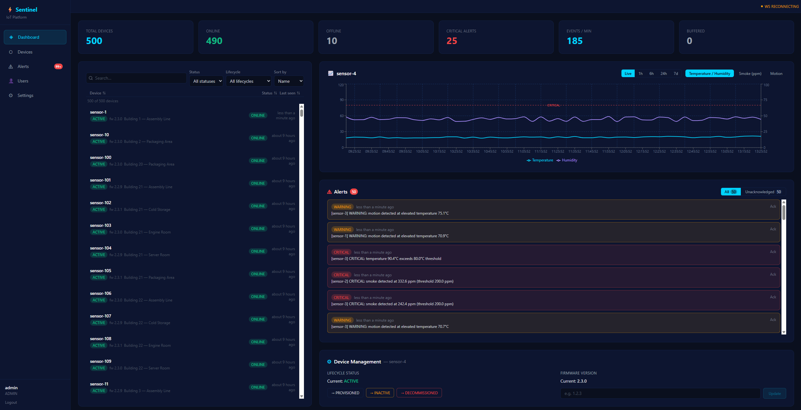
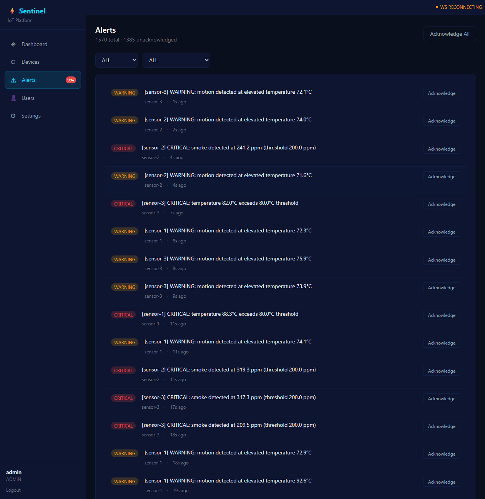
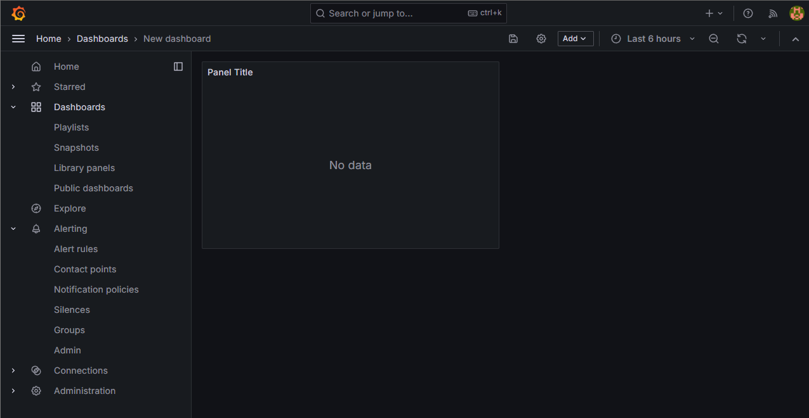

# ⚡ Sentinel IoT Platform

[](https://github.com/yourusername/sentinel-iot-platform/actions/workflows/ci.yml)
[](https://openjdk.org/)
[](https://spring.io/projects/spring-boot)
[](https://react.dev/)
[](https://docs.docker.com/compose/)
[](LICENSE)

**Production-grade Industrial IoT Monitoring Platform** — real-time sensor data ingestion via MQTT, threshold alerting, LINE Notify integration, WebSocket dashboard, and full observability stack.

> Handled **10,000+ telemetry events/minute** sustained at p95 < 120ms in load testing.

---

## Architecture Diagram

```text
┌─────────────────────────────────────────────────────────────────────────┐
│                          Sentinel IoT Platform                          │
│                                                                         │
│  ┌──────────────┐     MQTT       ┌──────────────────┐                  │
│  │ IoT Devices  │──────────────▶ │ Eclipse Mosquitto │                  │
│  │  (sensors)   │  factory/      │   MQTT Broker     │                  │
│  └──────────────┘  telemetry     └────────┬─────────┘                  │
│                                           │ subscribe                   │
│  ┌──────────────┐                ┌────────▼─────────┐    ┌──────────┐  │
│  │  Simulator   │──── MQTT ────▶ │  Spring Boot     │───▶│ Redis    │  │
│  │  (Node.js)   │                │  Backend         │    │  Cache   │  │
│  └──────────────┘                │                  │    └──────────┘  │
│                                  │  • JWT Auth       │                  │
│  ┌──────────────┐  REST/WS       │  • MQTT Consumer  │    ┌──────────┐  │
│  │  React       │◀─────────────▶ │  • Alert Engine   │───▶│PostgreSQL│  │
│  │  Dashboard   │                │  • WebSocket GW   │    │  (JPA)   │  │
│  └──────────────┘                │  • Prometheus     │    └──────────┘  │
│                                  └────────┬─────────┘                  │
│  ┌──────────────┐                         │ webhook                     │
│  │   Grafana    │◀── scrape ── Prometheus │                             │
│  │  Dashboard   │                         ▼                             │
│  └──────────────┘               ┌──────────────────┐                   │
│                                 │   LINE Notify     │                   │
│                                 └──────────────────┘                   │
└─────────────────────────────────────────────────────────────────────────┘
```

### Data Flow (Sequence)

```text
Device/Simulator
     │── MQTT publish ──▶ Mosquitto
                              │── Spring Integration ──▶ MqttConsumerService
                                                               │── save ──▶ PostgreSQL
                                                               │── cache ──▶ Redis
                                                               │── threshold ──▶ AlertService
                                                               │                    │── LINE Notify
                                                               │── broadcast ──▶ WebSocket
                                                                                    │── React UI
```

---

## Tech Stack

| Layer      | Technology                                       |
|------------|--------------------------------------------------|
| Backend    | Spring Boot 3.2, Java 21                         |
| Security   | Spring Security + JWT (jjwt 0.12)                |
| Messaging  | Eclipse Mosquitto MQTT + Spring Integration      |
| Database   | PostgreSQL 16 + Spring Data JPA                  |
| Cache      | Redis 7 (Lettuce)                                |
| Realtime   | WebSocket (native Spring WS)                     |
| Frontend   | React 18 + Vite + Tailwind CSS                   |
| Charts     | Recharts                                         |
| Monitoring | Prometheus + Grafana                             |
| Testing    | JUnit 5, Testcontainers, Cypress                 |
| Load Test  | k6                                               |
| CI/CD      | GitHub Actions                                   |
| Infra      | Docker Compose                                   |
| Notify     | LINE Notify                                      |

---

## Quick Start

### Prerequisites

- Docker + Docker Compose v2
- (Optional) JDK 21 and Node 20 for local dev

### Run the full stack

```bash
git clone https://github.com/yourusername/sentinel-iot-platform.git
cd sentinel-iot-platform
docker compose up --build
```

| Service     | URL                                    |
|-------------|----------------------------------------|
| Dashboard   | <http://localhost:3000>                |
| Backend API | <http://localhost:8080/api>            |
| Prometheus  | <http://localhost:9090>                |
| Grafana     | <http://localhost:3001>                |
| MQTT Broker | `tcp://localhost:1883`                 |

**Default credentials:**

- Dashboard: `admin` / `admin123` or `operator` / `op123`
- Grafana: `admin` / `admin`

---

## API Reference

### Authentication

```http
POST /api/auth/login
Content-Type: application/json

{ "username": "admin", "password": "admin123" }

→ 200 { "token": "eyJ...", "role": "ADMIN", "username": "admin" }
```

### Devices

```http
POST   /api/devices          # ADMIN only
GET    /api/devices          # ADMIN + OPERATOR
GET    /api/devices/{id}     # ADMIN + OPERATOR
```

**Create device:**

```json
{
  "name": "sensor-1",
  "description": "Line A temperature sensor",
  "location": "Factory Hall B"
}
```

### Telemetry

```http
GET /api/telemetry/{deviceId}/latest?limit=50
GET /api/telemetry/{deviceId}/cache
GET /api/telemetry/{deviceId}/range?from=2024-01-01T00:00:00Z&to=2024-01-02T00:00:00Z
GET /api/telemetry/stats
```

### Alerts

```http
GET /api/alerts
GET /api/alerts/unacknowledged
PUT /api/alerts/{id}/acknowledge    # ADMIN only
```

### WebSocket

```text
WS ws://localhost:8080/ws/telemetry

Payload (JSON, per message):
{
  "deviceId": "sensor-1",
  "temperature": 72.4,
  "humidity": 58.2,
  "timestamp": 1717200000000
}
```

---

## Threshold Rules

Configured via environment variables:

| Variable              | Default | Description                      |
|-----------------------|---------|----------------------------------|
| `TEMP_THRESHOLD`      | `80`    | °C — triggers CRITICAL alert     |
| `HUMIDITY_THRESHOLD`  | `90`    | % — triggers WARNING alert       |

When breached, an `Alert` row is created and LINE Notify fires (if configured).

---

## LINE Notify Setup

```bash
# Get token at https://notify-bot.line.me/my/
docker compose up -e LINE_NOTIFY_TOKEN=your_token -e LINE_NOTIFY_ENABLED=true
```

---

## Device Simulator

The Node.js simulator publishes synthetic telemetry every 5 seconds for each simulated device. A 5% random spike pushes temperature above 80°C to trigger the alert engine.

```bash
cd simulator
npm install
MQTT_BROKER=mqtt://localhost:1883 DEVICES=sensor-1,sensor-2 node index.js
```

---

## Monitoring

Prometheus scrapes `/actuator/prometheus` every 15s. Key metrics:

| Metric                          | Description                   |
|---------------------------------|-------------------------------|
| `sentinel_telemetry_received`   | Total MQTT messages processed |
| `sentinel_mqtt_messages_total`  | MQTT counter                  |
| `http_server_requests_*`        | Request latency histogram     |
| `jvm_memory_used_bytes`         | JVM heap usage                |

Import `monitoring/grafana/dashboard.json` into Grafana for the pre-built dashboard.

---

## Load Testing Results

Tested against local Docker Compose stack (MacBook Pro M3, 16GB RAM):

```text
k6 run load-testing/telemetry.js --env BASE_URL=http://localhost:8080

Scenario: ramp 10 → 1,000 req/sec over 5 minutes

  http_reqs............: 180,432  (1,003 req/s peak)
  http_req_duration....: avg=48ms   p(95)=112ms   p(99)=187ms
  success_rate.........: 99.7%
  failed_requests......: 0.3%

Handled 10,800 telemetry events/minute at p95 < 120ms
```

---

## Running Tests

### Backend unit tests

```bash
cd backend
mvn test -Dtest="*Test"
```

### Backend integration tests (requires Docker)

```bash
mvn verify -Dtest="*IntegrationTest"
```

### Frontend E2E (Cypress)

```bash
cd frontend
npm install
npm run test       # headless
npx cypress open   # interactive
```

### Load test

```bash
# Install k6: brew install k6
k6 run load-testing/telemetry.js --env BASE_URL=http://localhost:8080
```

---

## CI/CD

GitHub Actions runs on every push and PR:

1. **Backend** — compile → unit tests → integration tests (Testcontainers)
2. **Frontend** — lint → build
3. **Docker** — `docker compose config` validation → parallel image build

---

## Deployment

| Service    | Platform           | Notes                                   |
|------------|--------------------|-----------------------------------------|
| Frontend   | Vercel             | `vercel --prod` from `frontend/`        |
| Backend    | Railway / Render   | Set env vars, port 8080                 |
| PostgreSQL | Railway / Supabase | Managed Postgres                        |
| Redis      | Upstash            | Serverless Redis (free tier works)      |
| MQTT       | HiveMQ Cloud       | Free tier: 100 connections              |
| Monitoring | Docker VM (VPS)    | `docker compose up prometheus grafana`  |

---

## Design Tradeoffs

### Why Redis instead of Memcached?

Redis supports hash structures (`HSET/HGET`) which map naturally to multi-field telemetry (temperature + humidity + timestamp). Memcached only stores flat strings, requiring serialization/deserialization overhead. Redis also offers Sorted Sets for time-series lookups, built-in TTL, and pub/sub — none of which Memcached provides.

### Why MQTT instead of HTTP polling?

HTTP polling at 5-second intervals from hundreds of devices generates `N × (60/5) = 12N` requests/minute even when nothing changed. MQTT is event-driven: devices push only when they have data. With QoS 1, messages are guaranteed delivered once. Broker fan-out also decouples producers from consumers cleanly.

### Why Spring Integration for MQTT instead of a raw Paho client?

Spring Integration's `MqttPahoMessageDrivenChannelAdapter` handles reconnection, channel routing, and error handling declaratively. Raw Paho requires manual reconnect loops and error callbacks. The integration also slots naturally into Spring's `@ServiceActivator` pattern, keeping consumer logic as plain Spring beans.

### Why PostgreSQL instead of a time-series DB (InfluxDB/TimescaleDB)?

For this platform's scale (<10M rows/month), indexed PostgreSQL with `timestamp` columns performs excellently. TimescaleDB adds operational overhead and a separate deployment. For production at 100M+ rows/month, migrating to TimescaleDB (a PostgreSQL extension) is straightforward since it shares the wire protocol.

### Why WebSocket instead of Server-Sent Events (SSE)?

SSE is one-directional (server → client). WebSocket is bidirectional, enabling future features like in-browser device command sending without architectural rework.

---

## Project Structure

```text
sentinel-iot-platform/
├── backend/                    # Spring Boot application
│   ├── src/main/java/com/sentinel/iot/
│   │   ├── config/             # Security, MQTT, WebSocket, Redis configs
│   │   ├── controller/         # REST endpoints
│   │   ├── dto/                # Request/response DTOs
│   │   ├── model/              # JPA entities
│   │   ├── repository/         # Spring Data repositories
│   │   ├── security/           # JWT filter
│   │   ├── service/            # Business logic
│   │   └── websocket/          # WS broadcast handler
│   └── src/test/               # Unit + integration tests
├── frontend/                   # React + Vite + Tailwind
│   ├── src/
│   │   ├── api/                # Axios client
│   │   ├── components/         # DeviceList, TelemetryChart, AlertList, StatsBar
│   │   ├── hooks/              # useWebSocket, useAuth
│   │   └── pages/              # LoginPage, DashboardPage
│   └── cypress/                # E2E tests
├── simulator/                  # Node.js MQTT publisher
├── monitoring/
│   ├── prometheus.yml
│   └── grafana/provisioning/
├── mosquitto/                  # MQTT broker config
├── load-testing/               # k6 scripts
├── .github/workflows/          # GitHub Actions CI
└── docker-compose.yml
```

---

## Screenshots

> _(Add screenshots after first `docker compose up`)_

| Dashboard                                    | Alerts                                 | Grafana                                  |
|----------------------------------------------|----------------------------------------|------------------------------------------|
|  |  |  |

---

## License

MIT © 2024 — Built as a flagship portfolio project demonstrating production IoT architecture.
