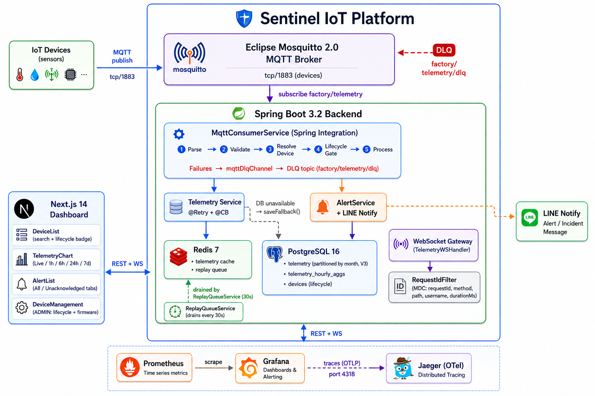
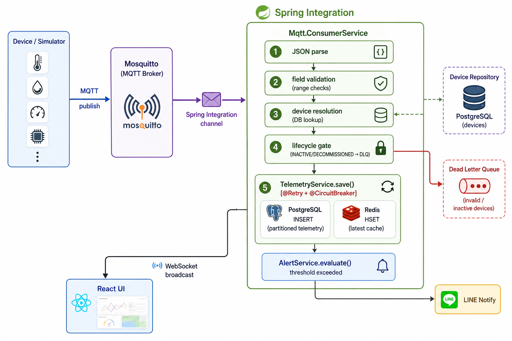
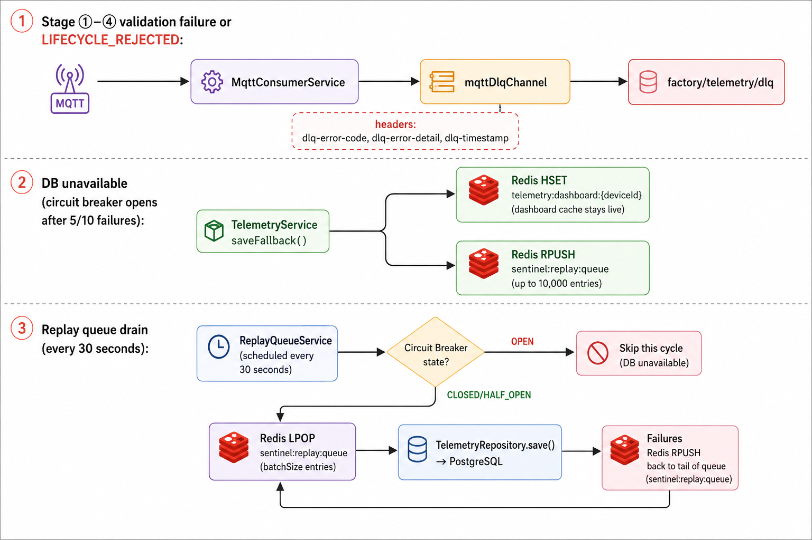
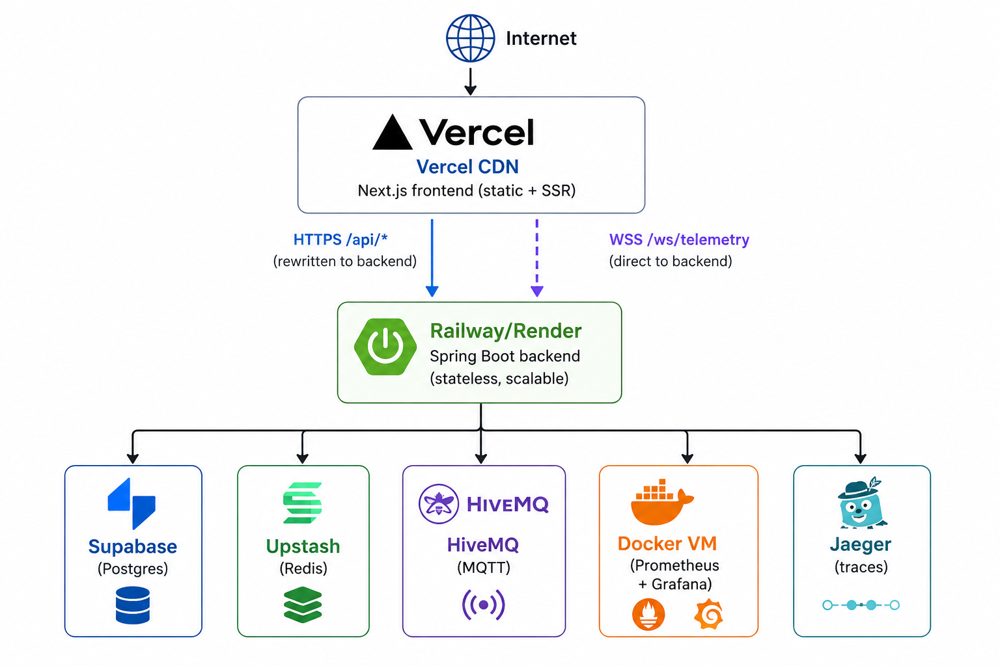

# Architecture

## System Overview

Sentinel IoT Platform is a production-grade industrial monitoring system built around an event-driven architecture. IoT devices publish sensor readings over MQTT every 5 seconds. A Spring Boot backend consumes these messages through a validated 5-stage ingestion pipeline, persists them to a partitioned PostgreSQL table, caches the latest values in Redis, evaluates threshold rules, and broadcasts updates to connected browsers via WebSocket. A Next.js dashboard renders real-time charts and historical analytics without polling.

---

## High-Level Diagram

<!--

-->

```text
                   ┌───────────────────────────────────────────────────────┐
                   │                  Sentinel IoT Platform                │
                   │                                                       │
 ┌─────────────┐   │  ┌─────────────────────────────────────────────────┐  │
 │ IoT Devices │──▶│  │              Eclipse Mosquitto 2.0              │  │
 │ (sensors)   │   │  │              MQTT Broker                        │  │
 └─────────────┘   │  │  tcp/1883 (devices)  ←── DLQ ──── factory/      │  │
                   │  │                              telemetry/dlq      │  │
 ┌─────────────┐   │  └──────────────────┬──────────────────────────────┘  │
 │  Node.js    │──▶│                     │ subscribe factory/telemetry     │
 │  Simulator  │   │  ┌──────────────────▼──────────────────────────────┐  │
 └─────────────┘   │  │               Spring Boot 3.2 Backend           │  │
                   │  │                                                 │  │
                   │  │  ┌──────────────────────────────────────────-┐  │  │
                   │  │  │  MqttConsumerService (Spring Integration) │  │  │
                   │  │  │  ① Parse → ② Validate → ③ Resolve Device│  │  │
                   │  │  │  ④ Lifecycle Gate → ⑤ Process            │  │  │
                   │  │  │  Failures → mqttDlqChannel → DLQ topic    │  │  │
                   │  │  └──────┬──────────────────┬────────────────-┘  │  │
                   │  │         │                  │                    │  │
                   │  │  ┌──────▼──────┐  ┌────────▼──────┐             │  │
                   │  │  │ Telemetry   │  │ AlertService  │             │  │
                   │  │  │ Service     │  │ + LINE Notify │             │  │
                   │  │  │ @Retry+@CB  │  └───────────────┘             │  │
                   │  │  └──────┬──────┘                                │  │
                   │  │         │ DB unavailable → saveFallback()       │  │
                   │  │         │                                       │  │
                   │  │  ┌──────▼──────┐  ┌─────────────────────────-┐  │  │
                   │  │  │ Redis 7     │  │ PostgreSQL 16            │  │  │
                   │  │  │ • telemetry │  │ • telemetry (partitioned │  │  │
                   │  │  │   cache     │  │   by month, V3)          │  │  │
                   │  │  │ • replay    │  │ • telemetry_hourly_aggs  │  │  │
                   │  │  │   queue     │  │ • devices (lifecycle)    │  │  │
                   │  │  └─────────────┘  └─────────────────────────-┘  │  │
                   │  │         ↑ drained by ReplayQueueService (30s)   │  │
                   │  │                                                 │  │
                   │  │  ┌──────────────────────────────────────────┐   │  │
                   │  │  │  WebSocket Gateway (TelemetryWSHandler)  │   │  │
                   │  │  └──────────────────────────────────────────┘   │  │
                   │  │                                                 │  │
                   │  │  ┌──────────────────────────────────────────┐   │  │
                   │  │  │  RequestIdFilter (MDC: requestId, method,│   │  │
                   │  │  │  path, username, durationMs)             │   │  │
                   │  │  └──────────────────────────────────────────┘   │  │
                   │  └──────────────────┬────────────────────────────--┘  │
                   │                     │ REST + WS                       │
                   │  ┌──────────────────▼───────────────────────────-─┐   │
                   │  │         Next.js 14 Dashboard                   │   │
                   │  │  DeviceList (search + lifecycle badge)         │   │
                   │  │  TelemetryChart (Live/1h/6h/24h/7d)            │   │
                   │  │  AlertList (All/Unacknowledged tabs)           │   │
                   │  │  DeviceManagement (ADMIN: lifecycle + firmware)│   │
                   │  └────────────────────────────────────────────────┘   │
                   │                                                       │
                   │  ┌────────────┐  scrape  ┌──────────┐  traces         │
                   │  │ Prometheus │─────────▶│  Grafana │                 │
                   │  └────────────┘          └──────────┘                 │
                   │  ┌──────────────────┐  ← OTLP (port 4318)             │
                   │  │ Jaeger (OTel)    │  Distributed tracing            │
                   │  └──────────────────┘                                 │
                   └───────────────────────────────────────────────────────┘
```

---

## Data Flow

### Normal Ingestion Path

<!--

-->

```text
Device/Simulator
  │── MQTT publish ──▶ Mosquitto
                          │── Spring Integration channel ──▶ MqttConsumerService
                                                                │── ① JSON parse
                                                                │── ② field validation (range checks)
                                                                │── ③ device resolution (DB lookup)
                                                                │── ④ lifecycle gate (INACTIVE/DECOMMISSIONED → DLQ)
                                                                │── ⑤ TelemetryService.save()  [@Retry + @CircuitBreaker]
                                                                │        │── PostgreSQL INSERT (partitioned telemetry)
                                                                │        └── Redis HSET (latest cache)
                                                                │── AlertService.evaluate()
                                                                │        └── LINE Notify (threshold exceeded)
                                                                └── WebSocket broadcast ──▶ React UI
```

### Failure Paths

<!--

-->

```text
Stage ①–④ validation failure or LIFECYCLE_REJECTED:
  MqttConsumerService ──▶ mqttDlqChannel ──▶ factory/telemetry/dlq
                          headers: dlq-error-code, dlq-error-detail, dlq-timestamp

DB unavailable (circuit breaker opens after 5/10 failures):
  TelemetryService.saveFallback()
    │── Redis HSET (dashboard cache stays live)
    └── Redis RPUSH sentinel:replay:queue (up to 10,000 entries)

Replay queue drain (every 30 seconds):
  ReplayQueueService
    │── check circuit breaker state → skip if OPEN
    └── LPOP batchSize entries ──▶ TelemetryRepository.save() ──▶ PostgreSQL
          failures ──▶ RPUSH back to tail of queue
```

---

## Component Descriptions

### Eclipse Mosquitto (MQTT Broker)

- Protocol: MQTT 3.1.1 over TCP port 1883 and WebSocket port 9001
- `allow_anonymous false` — password file provisioned at startup by `docker-entrypoint.sh` from `MQTT_USER`/`MQTT_PASS` and per-device `MQTT_DEVICE_CREDENTIALS` env vars
- Per-user topic ACL enforced via `acl_file` — backend service account can subscribe and publish DLQ; device accounts can publish telemetry topics only
- TLS listener on port 8883 is auto-appended by the entrypoint when certs exist in `mosquitto/certs/` (run `scripts/gen-mqtt-certs.sh`). Set `MQTT_TLS_REQUIRED=true` to remove plaintext `:1883` entirely
- mTLS (mutual TLS, per-device client certificates) enabled by setting `MQTT_MTLS_ENABLED=true` — requires `gen-mqtt-certs.sh --with-client-certs`
- Persistence enabled so retained messages survive restarts
- QoS 1 used by both simulator and backend subscriber (at-least-once delivery)
- Receives DLQ messages on `factory/telemetry/dlq` from backend (outbound adapter)

**Production hardening checklist:**

| Control | Status |
|---|---|
| `allow_anonymous false` | Enforced |
| Password file per account | Enforced |
| Per-user ACL | Enforced |
| TLS on port 8883 | Opt-in (`MQTT_TLS_REQUIRED=true`) |
| mTLS client certificates | Opt-in (`MQTT_MTLS_ENABLED=true`) |
| Broker-side rate limiting | Not yet implemented — use a load balancer or mosquitto plugin |

### Spring Boot Backend

The backend is a single deployable JAR with the following internal layers:

| Layer | Package | Responsibility |
| --- | --- | --- |
| Security | `security/` | JWT filter, BCrypt password encoding, TenantContext |
| Request Correlation | `config/RequestIdFilter` | MDC: requestId, method, path, username, durationMs |
| Config | `config/` | MQTT + DLQ channels, WebSocket, Redis (DB0/DB1), Security beans |
| Controller | `controller/` | REST endpoints — auth, devices (incl. enrollment), telemetry, alerts |
| Service | `service/` | TelemetryService, AlertService, RedisService, ReplayQueueService, TelemetryRetentionService, DeviceService, DeviceEnrollmentService, NotificationService, BusinessMetricsService |
| Notification | `service/notification/` | NotificationProvider interface + LineNotifyProvider (deprecated), SlackNotificationProvider, WebhookNotificationProvider (HMAC-SHA256 signed) |
| Repository | `repository/` | Spring Data JPA — devices, telemetry, hourly aggregates, alerts, users, enrollment tokens |
| WebSocket | `websocket/` | `CopyOnWriteArrayList` of active sessions, Redis Pub/Sub fan-out, broadcast |
| DTOs | `dto/` | Request/response DTOs, ReplayQueueMessage, DeviceEnrollRequest, EnrollmentTokenResponse |

**Resiliency:** `TelemetryService.save()` is decorated with `@Retry(name="telemetryDB")` (3 attempts, 500ms wait) and `@CircuitBreaker(name="telemetryDB")` (opens at 50% failure rate in a 10-call window; waits 30s before HALF_OPEN). The fallback buffers to Redis.

**Backpressure:** `MqttConsumerService` holds a `Semaphore` with `ingestion.max-concurrent-messages` permits (default: 200). When the semaphore is exhausted, the message is shed immediately and routed to DLQ with error code `LOAD_SHED`. Counters: `sentinel.mqtt.load_shed` (Counter), `sentinel.mqtt.active_permits` (Gauge).

### Redis

Two logical Redis databases are configured to isolate failure domains:

| DB | Connection factory | Purpose |
| --- | --- | --- |
| DB 0 | `defaultRedisConnectionFactory` | Telemetry cache, replay queue, WebSocket pub/sub |
| DB 1 | `authRedisConnectionFactory` | JWT JTI blocklist (used by `JwtService`) |

Production upgrade path: point `redis.auth.host` / `redis.auth.port` at a separate Redis instance to physically isolate auth state from cache failures.

Key patterns (all DB 0 unless noted):

| Key pattern | Type | TTL | Purpose |
| --- | --- | --- | --- |
| `device:status:{orgId}:{deviceId}` | String | 10 min | Online/Offline status (tenant-namespaced when `TenantContext` is set) |
| `device:telemetry:{orgId}:{deviceId}` | Hash | 10 min | Latest temperature, humidity, motion, smokePpm, ts |
| `sentinel:replay:queue` | List | none | Buffered telemetry during DB outages (RPUSH/LPOP) |
| `jti:{jti}` (DB 1) | String | token TTL | Revoked access token JTI blocklist |

Sub-millisecond reads from the `device:telemetry` hash power the `/cache` API endpoint. Redis uses `appendfsync always` to guarantee no data loss on crash.

### PostgreSQL

Six domain tables (schema at V6 migration):

```text
app_users         devices                         telemetry (partitioned by month)
──────────        ─────────────────────────────   ──────────────────────────────────
id UUID           id UUID                         id UUID (UNIQUE INDEX, not PK)
username          name UNIQUE                     device_id UUID FK
password          status                          schema_version INT DEFAULT 1
role              location                        temperature DOUBLE
                  created_at                      humidity DOUBLE
                  last_seen                       motion BOOLEAN
                  lifecycle_status                smoke_ppm DOUBLE
                  firmware_version                timestamp TIMESTAMPTZ  ← partition key
                  firmware_updated_at             readings JSONB          ← v2 dynamic sensors
                  capabilities JSONB              edge_firmware_version VARCHAR
                                                  edge_ip VARCHAR
alerts                                            edge_uptime_seconds BIGINT
──────────────    ──────────────────              edge_rssi INT
id UUID PK        refresh_tokens                  edge_snr INT
device_id FK                                      edge_battery_voltage DOUBLE
level VARCHAR                                     edge_battery_pct INT
message TEXT                                      edge_free_heap_bytes INT
acknowledged BOOL                                 edge_protocol VARCHAR
created_at
                  telemetry_hourly_aggregates
                  ─────────────────────────────
                  id UUID PK
                  device_id UUID FK
                  hour_bucket TIMESTAMPTZ
                  temp_avg/min/max DOUBLE
                  hum_avg/min/max DOUBLE
                  smoke_avg/max DOUBLE
                  motion_count / sample_count
                  UNIQUE(device_id, hour_bucket)
```

Seven domain tables (schema at V8 migration):

```text
device_enrollment_tokens
────────────────────────
id UUID PK
device_id UUID FK
organization_id UUID
token_hash VARCHAR(128) UNIQUE  ← SHA-256 of raw token; raw token never stored
expires_at TIMESTAMPTZ
used_at TIMESTAMPTZ             ← set on first successful enroll (single-use)
used_by_ip VARCHAR
created_at TIMESTAMPTZ
created_by VARCHAR
```

Row Level Security (`V7__row_level_security.sql`) is enabled and forced on `devices`, `alerts`, and `audit_logs`. Policy: `organization_id = current_setting('app.org_id', true)::uuid`. The application sets this session variable via a Hibernate interceptor / Spring AOP call before each query.

**Key indexes:** `idx_telemetry_readings` (GIN on `readings` JSONB), `idx_telemetry_battery_pct`, `idx_telemetry_rssi` (scalar indexes for trending queries), `idx_devices_capabilities` (GIN on capabilities JSONB).

**Partitioning:** The `telemetry` table uses `PARTITION BY RANGE(timestamp)` with monthly child tables (`telemetry_2025_01` through `telemetry_2026_12`) plus `telemetry_default` for rows outside the range. PostgreSQL partition pruning eliminates child tables from range queries automatically.

**Indexes:** `idx_telemetry_id` (UNIQUE on `id`), `idx_telemetry_device_id`, `idx_telemetry_timestamp`, `idx_telemetry_device_ts` (composite on `device_id, timestamp DESC`).

**Lifecycle:** The `lifecycle_status` column uses a PostgreSQL `VARCHAR` column backed by a Java `DeviceLifecycleStatus` enum (`PROVISIONED`, `ACTIVE`, `INACTIVE`, `DECOMMISSIONED`). `DECOMMISSIONED` is terminal — the service layer rejects further transitions.

### Next.js 14 Dashboard

- **App Router** with `'use client'` boundaries only where browser APIs are needed
- API calls proxied through `next.config.mjs` rewrites (`/api/v1/*` → backend) — no CORS configuration required
- WebSocket connects directly to backend port 8080 via `NEXT_PUBLIC_WS_URL`
- Auto-reconnects with **exponential backoff + jitter** (`min(1000 × 2^attempt, 30000)` ms ±30%) on disconnect; resets to 0 on successful connect
- **Server state:** React Query (`@tanstack/react-query`) — `useQuery` for devices/alerts/stats/telemetry; `useMutation` with `onMutate` rollback for optimistic alert acknowledgement; 30-second background refetch
- **Client state:** Zustand store — `selectedDeviceId` (normalized UUID, not the full object), `filters` (search/status/lifecycle/sort), `isOffline` flag
- **DeviceTable**: `@tanstack/react-virtual` row virtualisation — renders only visible rows regardless of list size (handles 10 000+ devices); keyboard-navigable (Tab/Enter/Space); ARIA grid semantics
- **TelemetryChart**: Live / 1h / 6h / 24h / 7d time window selector; 24h and 7d use hourly aggregates with shaded min/max bands
- **AlertList**: All / Unacknowledged filter tabs; optimistic acknowledge (UI updates instantly, rolls back on error)
- **StatsBar**: 6 tiles including Buffered (replay queue depth, orange when > 0)
- **DeviceManagement**: ADMIN-only panel for lifecycle transitions, firmware version, and sensor capability map
- **OfflineBanner**: Listens to `window` online/offline events; shows fixed banner; pauses live data description
- **ErrorBoundary**: Scoped per panel — a crash in one panel does not unmount the whole dashboard
- **Design system primitives:** Badge (variant-aware), Select (accessible label+options), used consistently across all components

### Observability Stack

**Prometheus + Grafana:** Prometheus scrapes `/actuator/prometheus` every 15 seconds. Key metrics:

| Metric | Type | Description |
| --- | --- | --- |
| `sentinel_telemetry_received_total` | Counter | MQTT messages ingested successfully |
| `sentinel_telemetry_dropped_total` | Counter | Messages buffered to replay queue (DB unavailable) |
| `sentinel_mqtt_messages_total` | Counter | All MQTT messages received (before validation) |
| `sentinel_mqtt_dlq_total` | Counter | Messages routed to DLQ |
| `sentinel_mqtt_load_shed` | Counter | Messages shed due to concurrency limit (`ingestion.max-concurrent-messages`) |
| `sentinel_mqtt_active_permits` | Gauge | Current in-flight MQTT processing count |
| `sentinel_replay_queue_size` | Gauge | Current replay queue depth in Redis |
| `sentinel_replay_success_total` | Counter | Messages successfully replayed from queue |
| `sentinel_replay_failure_total` | Counter | Replay failures (re-queued) |
| `sentinel.business.active_devices` | Gauge | Devices with `status = ONLINE` (refreshed every 30s) |
| `sentinel.business.total_devices` | Gauge | Total registered devices |
| `sentinel.business.unack_alerts` | Gauge | Unacknowledged alert count |
| `sentinel.business.alert_fired` | Counter | Alerts fired since startup |
| `resilience4j_circuitbreaker_state` | Gauge | CB state (0=CLOSED, 1=OPEN, 2=HALF_OPEN) |
| `http_server_requests_seconds` | Histogram | Latency per endpoint |

**Jaeger (Distributed Tracing):** All requests are traced end-to-end via OpenTelemetry → Jaeger (OTLP port 4318, UI port 16686). Custom spans:

- `telemetry.save` tagged with `device.id` — covers DB write + Redis update + CB overhead
- `alert.evaluate` tagged with `device.id` and `device.name` — covers threshold check + LINE Notify call

The `traceId` and `spanId` are injected into MDC via Micrometer Tracing so every JSON log line can be correlated with its Jaeger trace.

**Structured Logging:** `logback-spring.xml` selects by profile:

- `prod`: Logstash JSON encoder — fields: `requestId`, `method`, `path`, `username`, `durationMs`, `traceId`, `spanId`
- default: human-readable console with `[requestId]` in the pattern

---

## Sensor Data Schema

The platform supports two payload generations. The ingest pipeline (Kafka consumer) branches on `schemaVersion`.

**v1 — fixed scalar fields** (legacy devices, backward-compatible):

```json
{
  "deviceId": "sensor-1",
  "schemaVersion": 1,
  "temperature": 72.4,
  "humidity": 58.2,
  "motion": false,
  "smokePpm": 12.5,
  "timestamp": 1717200000000
}
```

**v2 — dynamic readings map + edge metadata** (firmware 2.x+):

```json
{
  "deviceId": "sensor-1",
  "schemaVersion": 2,
  "timestamp": 1717200000000,
  "readings": {
    "TEMPERATURE": { "value": 72.4,  "unit": "°C",  "quality": "GOOD" },
    "CO2_PPM":     { "value": 412.0, "unit": "ppm", "quality": "GOOD" },
    "BATTERY_PCT": { "value": 87.0,  "unit": "%",   "quality": "GOOD" }
  },
  "edge": {
    "firmwareVersion": "2.4.1",
    "uptimeSeconds": 86400,
    "rssi": -67,
    "batteryPct": 87,
    "protocol": "MQTT_TLS"
  }
}
```

v1 validation rules (enforced before any DB/cache write):

| Field | Type | Valid range | Alert threshold |
| --- | --- | --- | --- |
| `deviceId` | String | Not null/blank | — |
| `temperature` | Double | -40 to 200 °C | > 80 °C → CRITICAL (global fallback) |
| `humidity` | Double | 0 to 100 % | > 90 % → WARNING (global fallback) |
| `motion` | Boolean | true / false | true + temp > 70 °C → WARNING |
| `smokePpm` | Double | ≥ 0 ppm | > 200 ppm → CRITICAL (global fallback) |

v2 alert evaluation uses per-device `capabilities` JSONB thresholds; falls back to global rules when capabilities are not configured.

---

## Telemetry Retention

The `TelemetryRetentionService` runs at 02:30 daily in three phases:

1. **Aggregate with late-arrival look-back**: Upserts `telemetry_hourly_aggregates` for the window `[today − lateArrivalLookbackDays, today)` (default look-back: 2 days). The `ON CONFLICT DO UPDATE` makes re-runs idempotent, so late-arriving IoT messages that land after midnight are automatically folded into the correct hour buckets on the next cron cycle.
2. **Prune**: Deletes raw rows older than `TELEMETRY_RETENTION_DAYS` (default 30).
3. **Drop old partitions**: Queries `pg_inherits` to find monthly child tables (e.g. `telemetry_2025_01`) older than the retention window, verifies the row count is 0 after pruning, then `DETACH PARTITION` + `DROP TABLE`. Prevents unbounded growth of the partition catalog.

Hourly aggregates have no expiry — they are the long-term analytics record. The dashboard's 24h and 7d chart modes read from this table.

---

## Deployment Topology

<!--

-->

```text
Internet
    │
    ▼
┌──────────────────┐
│  Vercel CDN      │  ← Next.js frontend (static + SSR)
└────────┬─────────┘
         │ HTTPS /api/*  (rewritten to backend)
         │ WSS /ws/telemetry (direct to backend)
         ▼
┌──────────────────┐
│  Railway/Render  │  ← Spring Boot backend (stateless, scalable)
│  (backend)       │
└────────┬─────────┘
         │
    ┌────┴──────┬──────────┬────────────┬────────────┐
    ▼           ▼          ▼            ▼            ▼
Supabase    Upstash    HiveMQ      Docker VM     Jaeger
(Postgres)  (Redis)    (MQTT)   (Prometheus    (traces)
                                 + Grafana)
```
