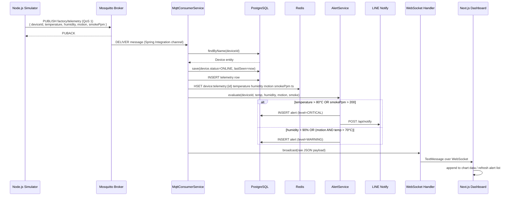
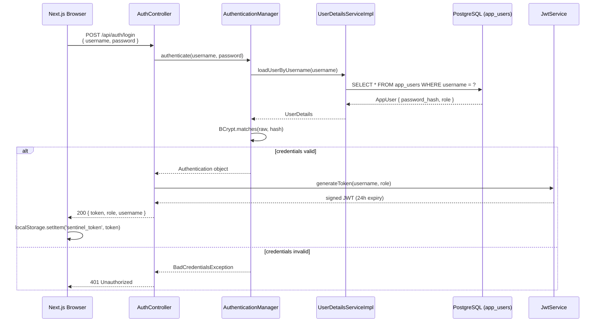
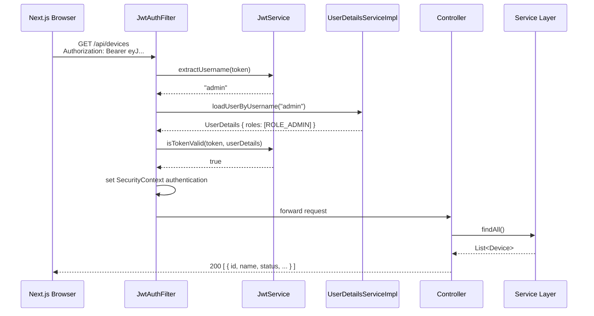
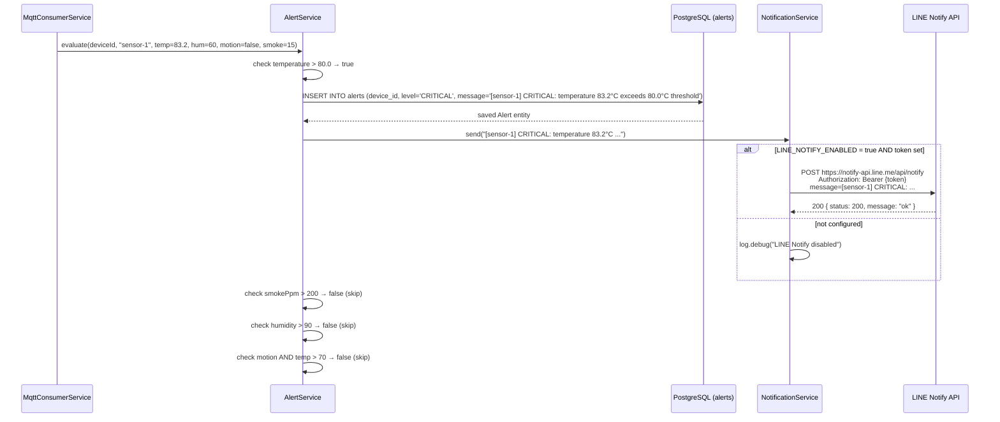
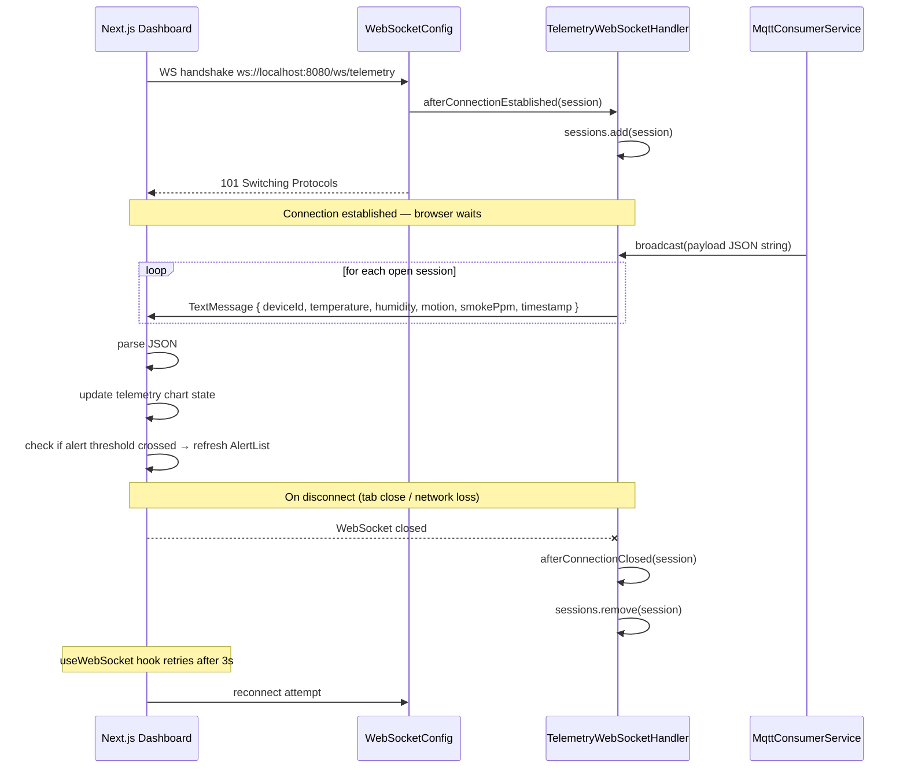
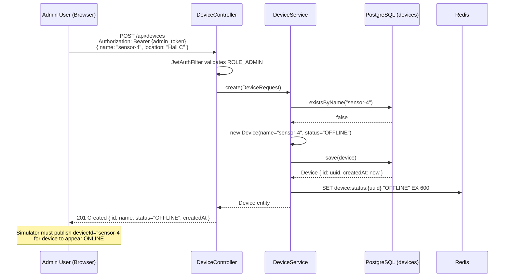

# Sequence Diagrams

All diagrams use [Mermaid](https://mermaid.js.org/) syntax and render natively on GitHub.

---

## 1. MQTT Telemetry Ingestion

The core data path from sensor to database, cache, alert engine, and browser.

---

## 2. User Authentication (JWT)

Login flow that produces a JWT used on all subsequent API calls.

---

## 3. Authenticated API Request (JWT Filter)

Every protected REST call passes through `JwtAuthFilter` before reaching the controller.

---

## 4. Alert Trigger and LINE Notification

Detail of how a threshold breach propagates to an alert record and external notification.

---

## 5. WebSocket Subscription and Realtime Update

How the browser receives live telemetry without polling.

---

## 6. Device Registration (ADMIN Flow)

End-to-end flow for an ADMIN registering a new device via the API.

