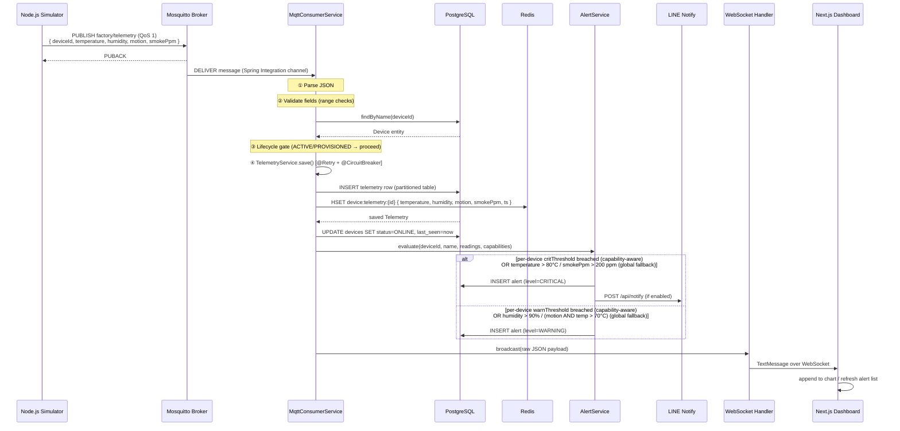
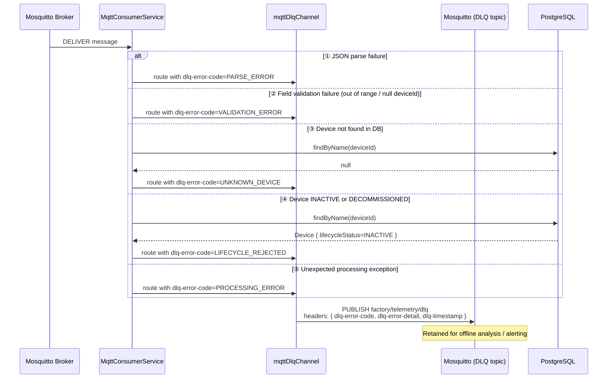
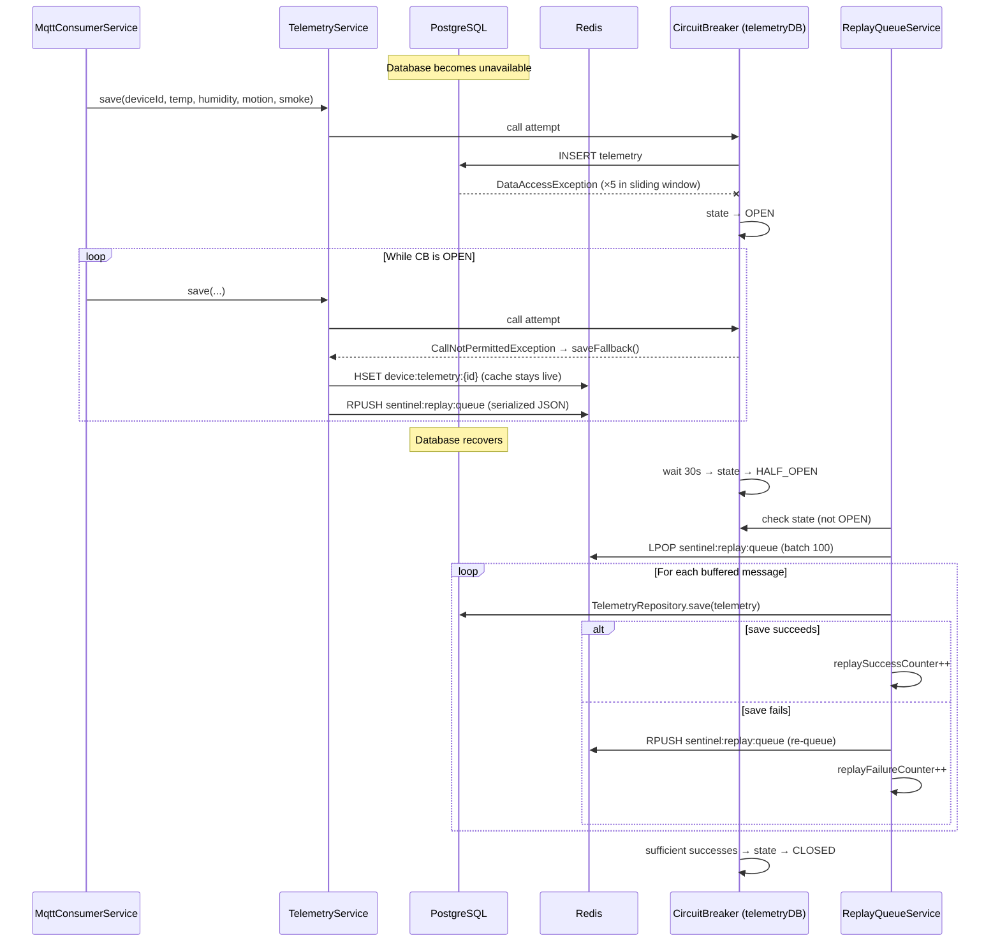
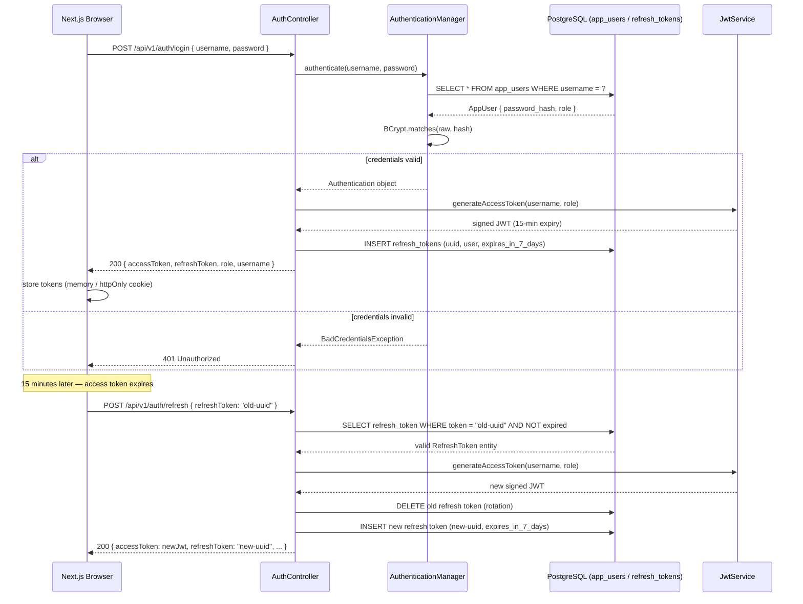
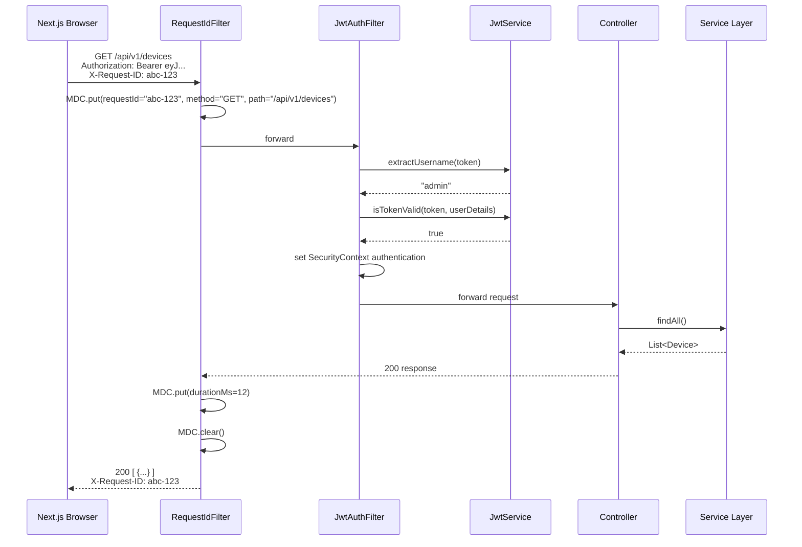
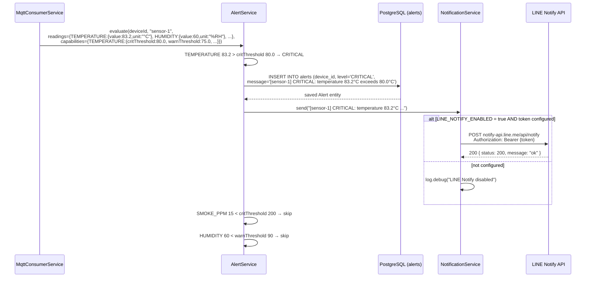
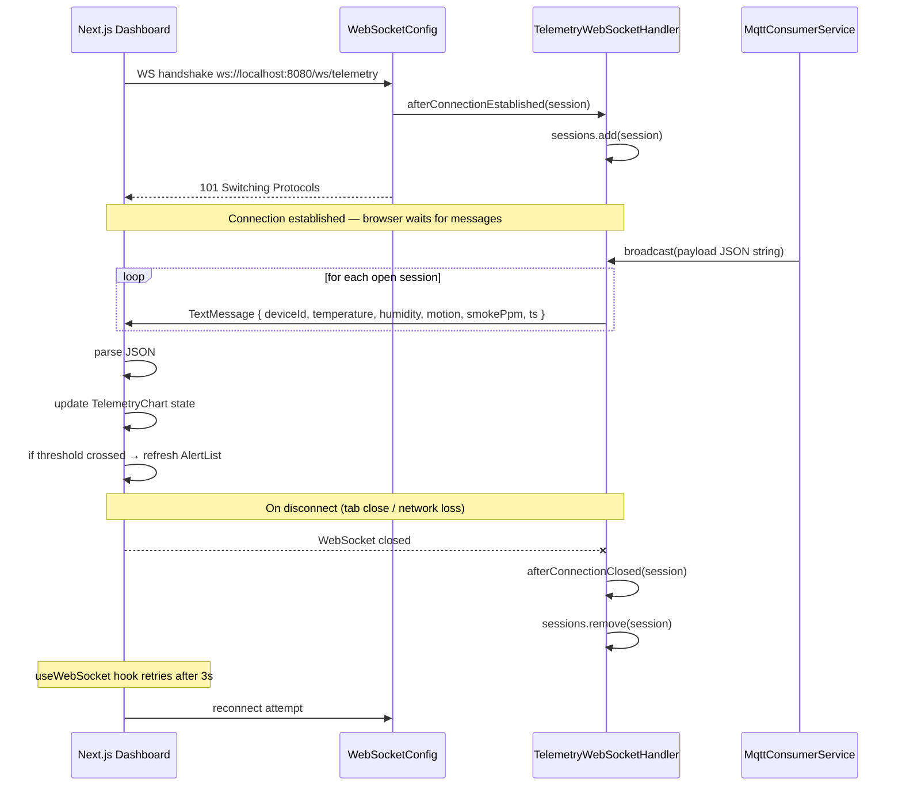
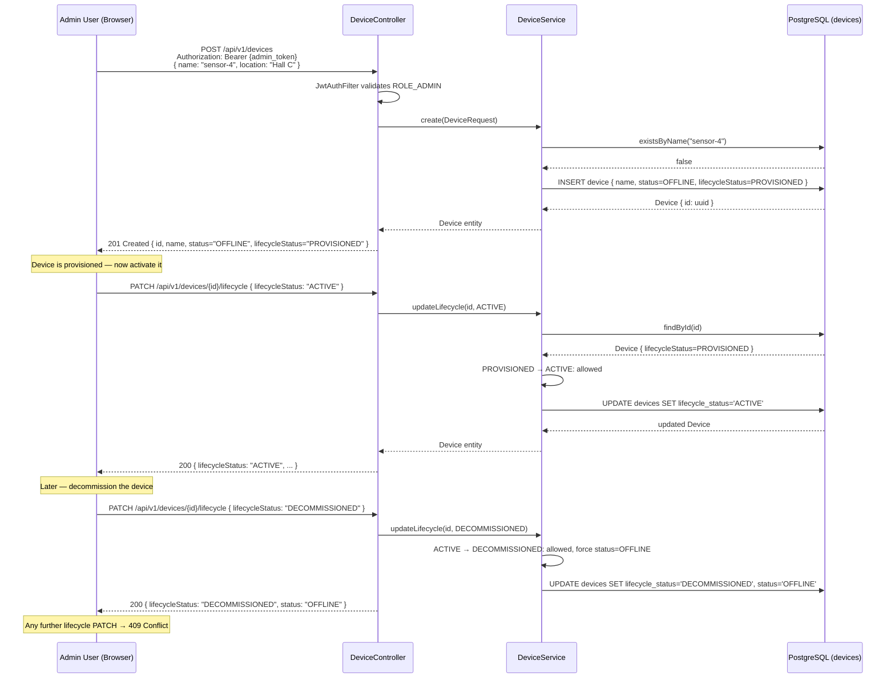
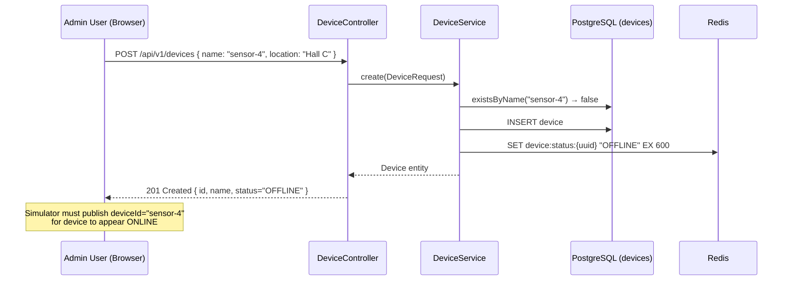

# Sequence Diagrams

All diagrams use [Mermaid](https://mermaid.js.org/) syntax and render natively on GitHub.

---

## 1. MQTT Telemetry Ingestion — Normal Path

The full 5-stage ingestion pipeline from sensor to database, cache, alert engine, and browser.

---

## 2. MQTT Ingestion — DLQ Failure Paths

How invalid payloads and lifecycle-rejected devices are routed to the dead letter queue.

---

## 3. DB Outage — Circuit Breaker + Replay Queue

How the system buffers telemetry during a database outage and recovers without data loss.

---

## 4. User Authentication (Login + Refresh Token Rotation)

Login flow that produces an access token and a refresh token with automatic rotation.

---

## 5. Authenticated API Request (JWT Filter + Request Correlation)

Every protected REST call passes through `RequestIdFilter` and `JwtAuthFilter` before reaching the controller.

---

## 6. Alert Trigger and LINE Notification

Detail of how a threshold breach propagates from ingestion to a persisted alert and external notification.

---

## 7. WebSocket Subscription and Realtime Update

How the browser receives live telemetry without polling.

---

## 8. Device Registration and Lifecycle Transition (ADMIN Flow)

End-to-end flow for registering a device and transitioning it through lifecycle states.

---

## 9. Device Registration (Legacy API-Only Flow)

Minimal flow for creating a device and verifying it goes online when the simulator publishes.

